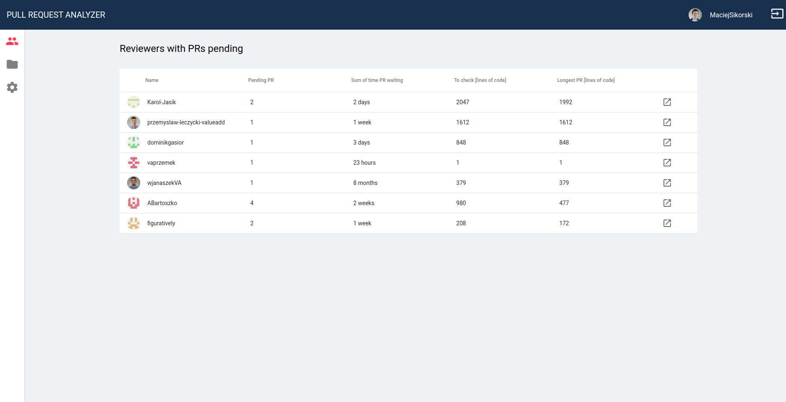

# Pimp My PR

A brilliant tool that will pimp your pull requests by collecting and presenting PR statistics.

## PMP-WEB

### Development

- install dependencies with `npm install`
- serve application with `ng serve`

### Build production

- install dependencies `npm install`
- build application `npm run build:pmp-web:prod`

## PMP-API

### Development

- copy `.env-sample` file as `.env` under `libs/server/shared/core/src/lib/config/` directory
- register application at https://github.com/settings/applications/new
- fill Client ID as `PMP_SERVER_GITHUB_CLIENT_ID` and Client Secret as `PMP_SERVER_GITHUB_CLIENT_SECRET`
- install dependencies with `npm install`
- (optional) start a database with docker `docker run --name pmp-postgres -e POSTGRES_PASSWORD=mysecretpassword -e POSTGRES_USER=pmp -p 5432:5432 -d postgres`
- serve application with `ng serve pmp-api`

### Build production

- install dependencies `npm install`
- build application `npm run build:pmp-api:prod`

### SWAGGER

API specification is available in swagger under the `/api` endpoint on the running pmp-api application.

## Start a production sandbox

- copy `.env-sample` file as `.env` under `libs/server/shared/core/src/lib/config/` directory
- fill `.env` file
- Build pmp-api and pmp-web as a production
- launch api `npm run run:pmp-api`
- launch frontend `npm run run:pmp-web`

## Production Server setup

- register application at https://github.com/settings/applications/new
- copy `.env-sample` file as `.env` in project root
- fill Client ID as `PMP_SERVER_GITHUB_CLIENT_ID` and Client Secret as `PMP_SERVER_GITHUB_CLIENT_SECRET`
- fill rest of the `.env` file
- run `docker-compose up -d`
