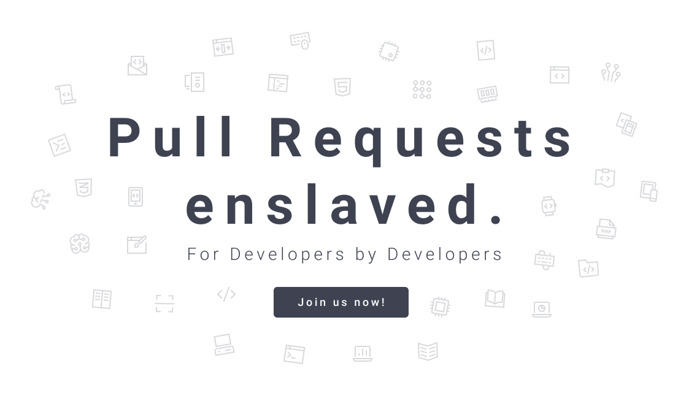

# 

A brilliant tool that will pimp your pull requests by collecting and presenting PR statistics.

### Setup

- copy `.env-sample` file as `.env` in project root
- fill the `.env` file

Generate repository platform client credentials:

#### Github

- register application at https://github.com/settings/applications/new
- Set callback URL as `http://your.pmp.domain/login?platform=github`

#### Bitbucket

Register application:

- Go to account settings
- Find "Access management" group
- Go to "OAuth"
- Add OAuth consumer with "Add consumer" button
  You can find out more at https://confluence.atlassian.com/x/pwIwDg
- Set callback URL as `http://your.pmp.domain/login?platform=bitbucket`
- Add Permissions to `Account:read`, `Repositories:read` and `Pull requests:read`

#### Gitlab

Register application:

- Go to account settings
- Find "Applications" group
- Add new application, setting following options
  Set Redirect URI as `http://your.pmp.domain/login?platform=gitlab`
  Select scopes `read_user`, `read_repository` and `read_api`

## Development

- install dependencies with `npm install`
- run `node ./scripts/init.js`
  or manually copy all sample files under `apps/pmp-web/src/assets/env/` directory
  without `.sample` key word and fill that files with proper configuration
- serve frontend application with `ng serve`
- (optional) start a database with docker `docker run --name pmp-postgres -e POSTGRES_PASSWORD=mysecretpassword -e POSTGRES_USER=pmp -p 5432:5432 -d postgres`
- serve api with `ng serve pmp-api`

### Build production

- install dependencies `npm install`
- build frontend application `npm run build:pmp-web:prod`
- build api `npm run build:pmp-api:prod`

## Production Server Setup

- clone the repository or copy just .env-sample and docker-compose.yml files to your device.
- go through the Setup section steps
- run `docker-compose up -d`

### SWAGGER

APIs specification is available in swagger under the `/api` endpoint on the running pmp-api application.
